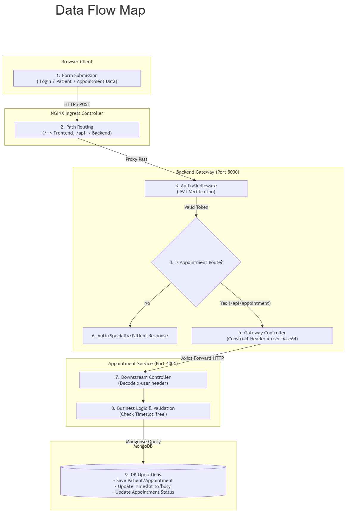
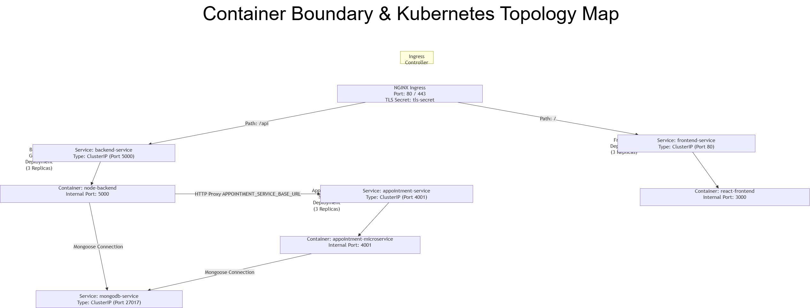
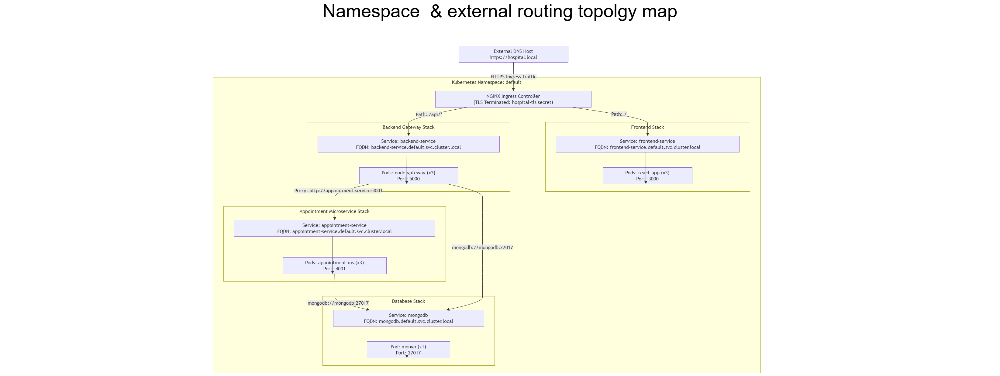

# 🏥 Hospital Core

A full-stack healthcare management platform built with a microservices architecture. The system allows patients to book appointments, doctors to manage and respond to appointment requests, and administrators to oversee healthcare operations.

The project demonstrates modern software engineering practices including:

- React + Vite Frontend
- Node.js + Express Backend
- Microservices Architecture
- MongoDB Database
- Docker Containerization
- Kubernetes Orchestration
- NGINX Ingress Routing
- TLS Encryption
- CI/CD with GitHub Actions
- Netlify & Vercel Deployment

---

## 📋 Table of Contents

- [Architecture Overview](#-architecture-overview)
- [Project Structure](#-project-structure)
- [Services](#-services)
- [Dependencies](#-dependencies)
- [Documentation](#-documentation)
- [Deployment Links](#-deployment-links)

---

## 🏗️ Architecture Overview

### Data Flow Map



### Container Boundary & Kubernetes Topology Map



### Namespace & External Routing Topology Map



### Infrastructure Components

| Component | Purpose |
|------------|----------|
| React Frontend | User Interface |
| Backend Service | Authentication, Authorization, Users, Doctors |
| Appointment Service | Appointment Booking & Management |
| MongoDB | Data Persistence |
| Docker | Containerization |
| Kubernetes | Orchestration |
| NGINX Ingress | Traffic Routing |
| TLS Secret | HTTPS Encryption |
| GitHub Actions | Automated CI/CD |

---

## 📂 Project Structure

```text
hospital-core/
│
├── frontend/
│
├── backend/
│
├── microservices/
│   └── appointment-service/
│
├── infra/
│   ├── docker-compose.yml
│   └── k8s/
│
├── docs/
│   ├── env.md
│   ├── setup.md
│   └── api.md
│
├── README.md
└── CHANGELOG.md
```

---

## 🔧 Services

### Frontend

Responsible for:

- Authentication UI
- Patient Dashboard
- Doctor Dashboard
- Appointment Booking
- Appointment Management
- API Communication

### Backend Service

Responsible for:

- Authentication
- Authorization
- JWT Tokens
- User Management
- Doctor Management
- Routing requests to the Appointment Service (for appointment/timeslot routes)

### Appointment Service

Responsible for:

- Appointment Creation
- Appointment Approval
- Appointment Rejection
- Timeslot Management

---

## 📦 Dependencies

### Frontend

| Package | Version |
|----------|----------|
| react | 19.2.7 |
| react-dom | 19.2.7 |
| react-router-dom | 7.18.1 |
| axios | 1.18.1 |
| zustand | 5.0.14 |
| @tanstack/react-query | 5.101.2 |
| sweetalert2 | 11.26.25 |
| sweetalert2-react-content | 5.1.2 |
| tailwindcss | 4.3.2 |
| @heroicons/react | 2.2.0 |

**Key dev/test tooling:** Vite, TypeScript, ESLint, Jest + Testing Library, Cypress, Lighthouse CI (`npm run lighthouse`).

### Backend Service

| Package | Version |
|----------|----------|
| express | 5.1.0 |
| mongoose | 8.18.0 |
| jsonwebtoken | 9.0.2 |
| bcryptjs | 3.0.2 |
| cookie-parser | 1.4.7 |
| cors | 2.8.5 |
| dotenv | 17.2.1 |
| multer | 2.0.2 |
| cloudinary | 2.7.0 |
| sharp | 0.34.3 |
| socket.io | 4.8.1 |
| axios | 1.11.0 |
| slugify | 1.6.6 |
| express-async-handler | 1.2.0 |
| express-rate-limiter | 1.3.1 |

**Key dev/test tooling:** Nodemon, Vite-Node, ESLint + Prettier, Jest + Supertest, mongodb-memory-server (integration tests), ngrok.

### Appointment Service

| Package | Version |
|----------|----------|
| express | 5.1.0 |
| mongoose | 8.18.0 |
| jsonwebtoken | 9.0.2 |
| bcryptjs | 3.0.2 |
| cookie-parser | 1.4.7 |
| cors | 2.8.5 |
| dotenv | 17.2.1 |
| multer | 2.0.2 |
| cloudinary | 2.7.0 |
| sharp | 0.34.3 |
| socket.io | 4.8.1 |
| axios | 1.11.0 |
| slugify | 1.6.6 |
| express-async-handler | 1.2.0 |
| express-rate-limiter | 1.3.1 |

**Key dev/test tooling:** Nodemon, Vite-Node, ESLint + Prettier, Jest + Supertest, mongodb-memory-server (integration tests), ngrok.

---

## 📚 Documentation

Further documentation lives in [`/docs`](./docs):

- [`docs/setup.md`](./docs/setup.md) — running locally, Docker, Kubernetes, testing, and the demo login/workflow.
- [`docs/env.md`](./docs/env.md) — environment variables for every service.
- [`docs/api.md`](./docs/api.md) — API route reference.

---

## 🌎 Deployment Links

### Frontend (Netlify)

```text
[ Add Netlify URL Here ]
```

### Backend (Vercel / Render)

```text
[ Add Backend URL Here ]
```

### Appointment Service (Vercel / Render)

```text
[ Add Appointment Service URL Here ]
```

---

## 👨‍💻 Author

Developed as part of a Full-Stack Healthcare Infrastructure project demonstrating:

- Frontend Engineering
- Backend Development
- Microservices
- DevOps
- Docker
- Kubernetes
- Networking
- TLS Security
- CI/CD Automation